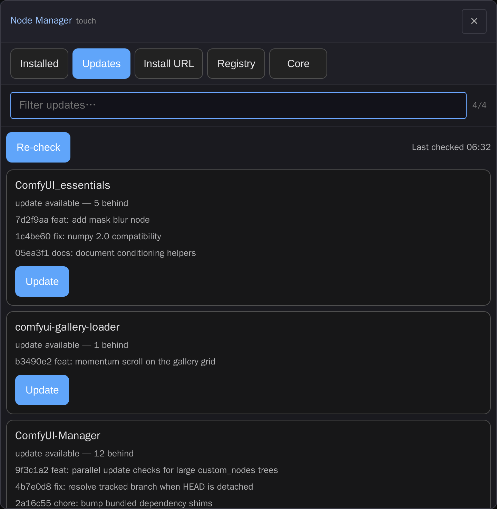

# comfyui-touch-manager

Touch-first node/extension manager for ComfyUI: check updates, update nodes and core, install from a GitHub URL, select versions, fuzzy search — mobile-friendly.

> Part of a family of mobile-first ComfyUI usability packs
> ([gallery-loader](https://github.com/laurigates/comfyui-gallery-loader),
> [sampler-info](https://github.com/laurigates/comfyui-sampler-info)):
> touch-friendly HTML modals that replace clunky native LiteGraph
> controls, detected by widget name, additive and non-clobbering.



*The Updates tab: each git-backed pack fetched and compared against its
tracked branch, with the incoming commits previewed and a one-tap Update.
(Screenshot uses representative data.)*

## Install

```sh
cd <ComfyUI>/custom_nodes
git clone https://github.com/laurigates/comfyui-touch-manager
cd comfyui-touch-manager
bun install
bun run build      # emit web/dist/ (served by ComfyUI)
```

Restart ComfyUI; hard-refresh the browser tab (Ctrl+Shift+R / Cmd+Shift+R).

## What it does

A full-screen, touch-first modal for managing custom-node packs from the
ComfyUI canvas — opened from a top action-bar button, the command palette
("Touch Node Manager"), the Extensions menu, or an optional sidebar tab. It's
built for phones and tablets: big tap targets, 16px inputs (no iOS zoom),
momentum scroll, and a fuzzy filter on every list. Five tabs:

- **Installed** — every pack across all `custom_nodes` roots, with its current
  git ref, whether it has local changes, and its remote. Per-pack **Update**,
  **Versions**, and **Uninstall** actions. Fuzzy search by name.
- **Updates** — fetches each git-backed pack's remote (streamed, a few at a
  time) and compares it against the tracked branch, listing the packs that are
  behind with a preview of the incoming commits and a one-tap **Update**.
  Results are cached, so updating one pack doesn't re-check every remote.
- **Install URL** — paste a GitHub/GitLab URL to clone a pack into
  `custom_nodes`. Gated by the server's bind policy (loopback by default; a
  non-loopback bind requires the `TOUCH_MANAGER_ALLOW_REMOTE_INSTALL` server
  env), the same gate the backend enforces.
- **Registry** — search [registry.comfy.org](https://registry.comfy.org) and
  install a pack by its registry or git version.
- **Core** — the ComfyUI core repo's ref and how far it is behind
  `origin`/`upstream`, with a fast-forward **Update core** action.

After any mutating action the modal shows a prominent "Restart ComfyUI to
apply" notice, with an optional one-tap restart when the server's reboot gate
permits it. All actions drive the pack's `/touch_manager/*` backend routes,
which use ComfyUI-bundled libraries only.

## Compatibility

- ComfyUI: modern Vue frontend (`comfyui-frontend-package >= 1.40`) for the
  `widget.onPointerDown` interception hook.
- Frontend changes take effect after `bun run build` + a browser hard-refresh —
  no ComfyUI restart.

## License

MIT — see `LICENSE`.
