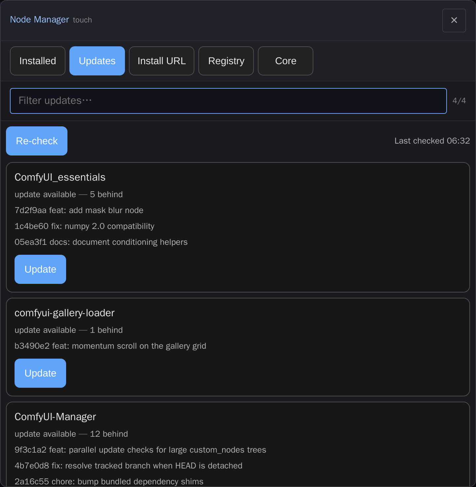

# comfyui-touch-manager

Touch-first node/extension manager for ComfyUI: check updates, update nodes and core, install from a GitHub URL, select versions, fuzzy search — mobile-friendly.

> Part of a family of mobile-first ComfyUI usability packs
> ([gallery-loader](https://github.com/laurigates/comfyui-gallery-loader),
> [sampler-info](https://github.com/laurigates/comfyui-sampler-info)):
> touch-friendly HTML modals that replace clunky native LiteGraph
> controls, detected by widget name, additive and non-clobbering.



*The Installed tab: every pack with its git ref, and each git-backed pack's
available update lazy-loaded inline — the incoming commits previewed and a
one-tap Update. (Screenshot uses representative data.)*

## Install

```sh
cd <ComfyUI>/custom_nodes
git clone https://github.com/laurigates/comfyui-touch-manager
cd comfyui-touch-manager
bun install
bun run build      # emit web/dist/ (served by ComfyUI)
```

Restart ComfyUI; hard-refresh the browser tab (Ctrl+Shift+R / Cmd+Shift+R).

## What it does

A full-screen, touch-first modal for managing custom-node packs from the
ComfyUI canvas — opened from a top action-bar button, the command palette
("Touch Node Manager"), the Extensions menu, or the sidebar's vertical-nav icon
(which opens the modal directly). It's built for phones and tablets: big tap
targets, 16px inputs (no iOS zoom), momentum scroll, and a fuzzy filter on every
list. Four tabs:

- **Installed** — every pack across all `custom_nodes` roots, with **a one-line
  description of what it is for**, its current git ref (or registry version),
  its author, whether it has local changes, its remote, and **how many nodes it
  registered in the running install** (with their top categories, e.g. `197
  nodes · ImpactPack`). Descriptions are read from the pack's own files with a
  fixed precedence — `pyproject.toml` `[project.description]`, then
  `package.json`, then the README's first prose paragraph — and never
  fabricated: a pack that describes itself nowhere shows no description line.
  Across a real 96-pack install this resolves 84 from `pyproject` and 12 from
  READMEs. Per-pack **Update**, **Versions**, **Forks**, **Disable**, and
  **Delete** actions (a disabled pack instead offers **Enable**, restoring it) —
  **Update** works for both git-backed packs (fetch + fast-forward) and packs
  installed from the Comfy Registry (re-downloads the latest published version).
  Updating a pack with **local changes** prompts before touching it: cancel, or
  **Force update** to discard the changes and proceed. Fuzzy search by name,
  author, remote URL, **or description** — so "upscale" finds the packs that do
  upscaling even when none of them says so in its directory name. The list
  paints instantly; a background sweep then
  checks each updatable pack (a few at a time) — a git fetch, or a registry
  version comparison — and fills its **available update** inline on the row.
  **Packs with an available update float to the top** once the sweep finishes.
  Results are cached, so updating one pack doesn't re-check everything; a
  **Re-check updates** button reruns the sweep on demand.
- **Forks** (from an Installed row) — switch a pack to a **different fork** of
  the same project without reinstalling it. The picker lists the repo it was
  forked from (upstream first) and the fork network's siblings by star count,
  straight from the GitHub API, marks the one you are already on, and always
  offers a paste-a-URL fallback for a fork it cannot enumerate (or a GitLab
  one). Switching repoints the pack's `origin` and checks out the new remote's
  default branch (or a ref you name) **in place**: the directory name and git
  history are kept, so the pack keeps working and later Updates track the fork.
  New Python dependencies are installed automatically. A dirty working tree
  prompts before anything is discarded.
- **Delete** (from an Installed row) — permanently remove a pack directory, the
  irreversible counterpart to **Disable**. It asks for an explicit confirmation
  that names the directory and points at Disable as the reversible alternative.
  It is live only when the server's delete gate permits it — loopback by
  default; a non-loopback bind (e.g. `--listen 0.0.0.0`) requires
  `TOUCH_MANAGER_ALLOW_REMOTE_DELETE=1` in the server environment. When the gate
  refuses, the button is shown **disabled** with the reason and the env var
  named above the list, rather than hidden: an action you cannot see is one you
  cannot know exists, let alone enable.
- **Install URL** — paste a GitHub/GitLab URL to clone a pack into
  `custom_nodes`. Gated by the server's bind policy (loopback by default; a
  non-loopback bind requires the `TOUCH_MANAGER_ALLOW_REMOTE_INSTALL` server
  env), the same gate the backend enforces.
- **Registry** — search [registry.comfy.org](https://registry.comfy.org) and
  install a pack by its registry or git version.
- **Core** — the ComfyUI core repo's ref and how far it is behind
  `origin`/`upstream`, with a fast-forward **Update core** action.

After any mutating action the modal shows a prominent "Restart ComfyUI to
apply" notice, with an optional one-tap restart when the server's reboot gate
permits it. All actions drive the pack's `/touch_manager/*` backend routes,
which use ComfyUI-bundled libraries only.

## Compatibility

- ComfyUI: modern Vue frontend (`comfyui-frontend-package >= 1.40`) for the
  `widget.onPointerDown` interception hook.
- Frontend changes take effect after `bun run build` + a browser hard-refresh —
  no ComfyUI restart.

## Bundled code

The served frontend (`web/dist/index.js`) is generated by `bun build` from the
TypeScript in `src/`. The build inlines one **first-party** dependency,
[`@laurigates/comfy-modal-kit`](https://github.com/laurigates/comfy-modal-kit)
(`pkg:npm/@laurigates/comfy-modal-kit`, MIT) — the shared modal/fuzzy-search
primitives used across this pack family. It is a declared npm dependency (see
`package.json`), not copied-in vendored source, and it is
[published to npm with build provenance](https://www.npmjs.com/package/@laurigates/comfy-modal-kit)
(SLSA, signed via GitHub Actions) attesting it was built from that repo.

The npm scope `@laurigates`, the GitHub org `laurigates`, and this pack's Comfy
Registry `PublisherId = laurigates` are the same author. So the inlined bundle's
upstream origin is identifiable and first-party — not unattributed third-party
code. Verify: `npm view @laurigates/comfy-modal-kit dist.attestations`.

## License

MIT — see `LICENSE`.
